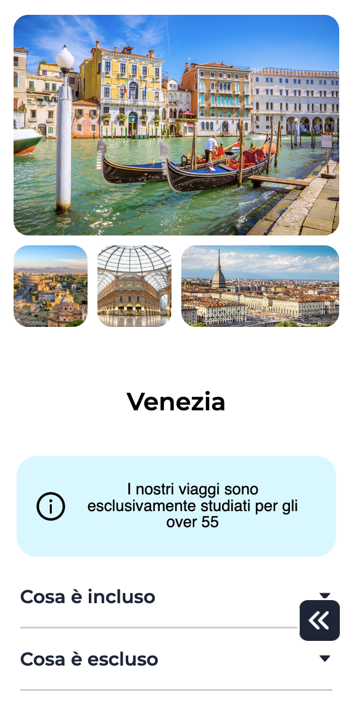
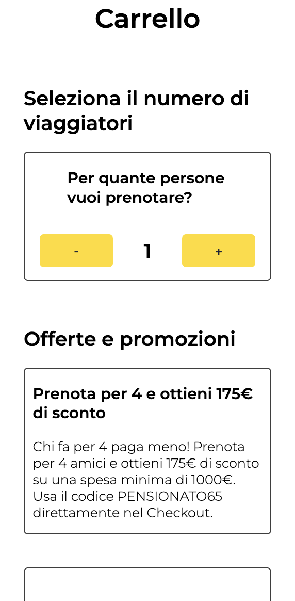

<p align="center">
  
</p>

<h2 align="center">FERDAST</h2>

<p align="center">
  
</p>

<hr>

<h2 align="center">A new project from Edgemony classes</h2>


<h2>Technologies used</h2>
  <ul>
    <li>HTML5</li>
    <li>CSS3</li>
    <li>SASS</li>
    <li>Javascript</li>
    <li>React.js</li>
    <li>Next.js</li>
    <li>Musement API</li>
    <li>Made with ❤️</li>
  </ul>

<br>
<hr>



<br>

<h2>Features</h2>
<ol>
  <li>Designed from zero</li>
  <li>Mobile First Design</li>
  <li>UI and UX user friendly</li>
  <li>Performance oriented</li>
  <li>Scalable and best practices</li>
  <li>Travel, enjoy🤩</li>
  <li>A lot of ❤️</li>
</ol>

<hr>

This is a [Next.js](https://nextjs.org/) project bootstrapped with [`create-next-app`](https://github.com/vercel/next.js/tree/canary/packages/create-next-app).

## How to run it!

First, run the development server:

```bash
npm run dev
# or
yarn dev
```

Open [http://localhost:3000](http://localhost:3000) with your browser to see the result.

You can start editing the page by modifying `pages/index.js`. The page auto-updates as you edit the file.

[API routes](https://nextjs.org/docs/api-routes/introduction) can be accessed on [http://localhost:3000/api/hello](http://localhost:3000/api/hello). This endpoint can be edited in `pages/api/hello.js`.

The `pages/api` directory is mapped to `/api/*`. Files in this directory are treated as [API routes](https://nextjs.org/docs/api-routes/introduction) instead of React pages.

<hr>

## Presentation day

<h4>Giugno 13 2022</h4>
<a href="https://cb3-argo-two-git-dev-casiimir.vercel.app/">Follow this link to visit it!</a>

<h3>Made by</h3>
<ul>
  <li>
    <a href="https://www.linkedin.com/in/chiara-zuccaro/">
      Chiara Zuccaro
    </a>
  </li>
  <li>
    <a href="https://www.linkedin.com/in/christopher-tarascio/">
      Christopher Tarascio
    </a>
  </li>
  <li>
    <a href="https://www.linkedin.com/in/andreamarialogiudice/">
      Andrea Maria Lo Giudice
    </a>
  </li>
  <li>
    <a href="https://www.linkedin.com/in/dennisbadagliacca/">
      Dennis Badagliacca
    </a>
  </li>
</ul>

<h4>With the special participation of
  <a href="https://www.linkedin.com/in/casimiro-p-ciancimino"> 
    Casimiro Pietro Ciancimino
  </a>
</h4>